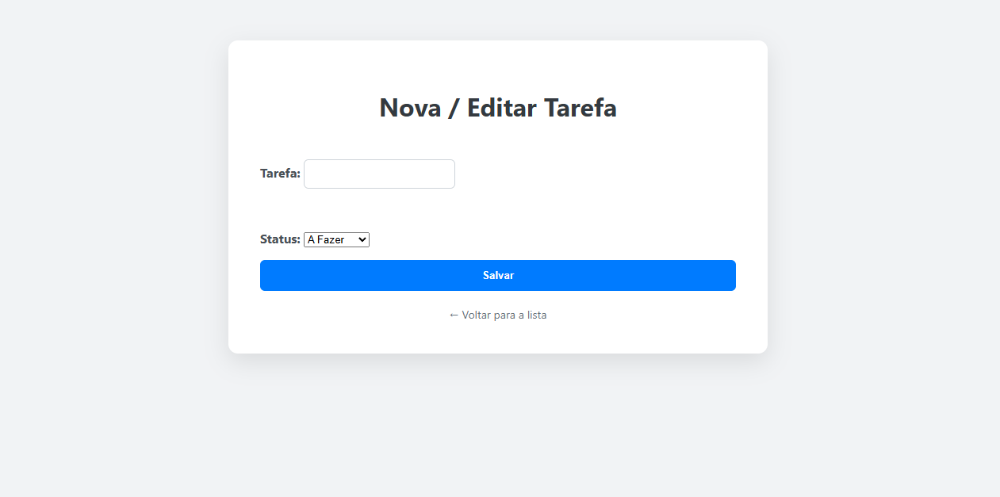

# 🧠 Meu Primeiro Projeto com Django

Este projeto foi desenvolvido durante o curso de férias do ENIAC, na aula de **"Montando meu primeiro site com Python"**, utilizando o framework **Django**.

A proposta foi construir a base de um site simples com backend em Python, onde aprendi a estruturar um projeto Django, configurar rotas, iniciar o servidor e entender a lógica por trás de aplicações web com Python.

> ⚠️ O projeto é introdutório, mas já me deu uma ótima noção do funcionamento do Django. Pretendo me aprofundar mais em breve, especialmente após concluir minha base em Python.

---

## 🧱 Tecnologias utilizadas

- Python 3  
- Django
- HTML básico
- CSS básico
- Ambiente virtual (codespace)

---

## 🚀 O que aprendi

- Estrutura de um projeto Django  
- Como iniciar um servidor local  
- Criação de rotas e views básicas  
- Organização de arquivos (apps, urls.py, views.py)  
- Integração simples com HTML no backend

---

## 📌 Próximos passos

Esse projeto foi um primeiro contato com o universo do backend web em Python. Assim que concluir os três mundos do curso de Python do Gustavo Guanabara, pretendo me aprofundar nas seguintes tecnologias:

- **Django (nível intermediário e avançado)**  
- **Flask**  
- **SQLite**  
- **Pandas e manipulação de dados**  
- Integração com front-end usando HTML + CSS

---

## 👨‍💻 Status do projeto

🟢 Finalizado (versão inicial)  
🔄 Aberto para futuras melhorias conforme evolução nos estudos

## 📁 Organização
/todolist-django/
├── app/
├── templates/
├── todolist/
├── manage.py
├── README.md
└── ...
